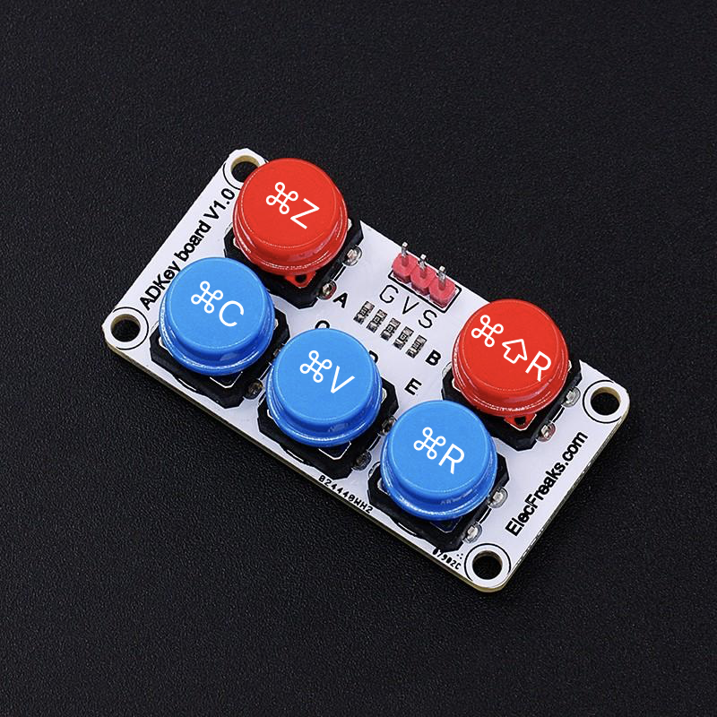

# The Key
## Stack Overflow's The Key™, but real

A macOS app that connects to the nearest micro:bit (more like the first micro:bit it finds) over Bluetooth.

How it works
- Look at the diagram to see what each button maps to
- Plug the cable into the other cable into your Mac and you're done
- It uses the micro:bit's bluetooth to interface with the custom built app and the custom built app's only job is to press buttons.

> sorry there's no proper pairing interface because i did this in 40 minutes so if you need, just run to a secluded room that is completely isolated from any micro:bits that may be attempting to connect to Bluetooth.

# Very cool. How to install?
## What you'll need
1. A micro:bit ([v1](https://gethacking.com/products/bbc-micro-bit-go) or [v2](https://gethacking.com/products/bbc-micro-bit-v2) works)
2. An [ADKeyPad](https://gethacking.com/products/octopus-adkeypad)
3. A [GVS Breakout Board](https://gethacking.com/products/elecfreaks-micro-bit-breakout-board)
4. A Mac 
5. A lot of patience 

## Install time
### Setting up Micro:bit
1. Connect your GVS Breakout Board to your micro:bit
2. Connect your ADKeypad to your GVS Breakout Board at **Pin 0**
3. Flash the `thekey.hex` file onto your micro:bit
4. To test it, press the A, B, C, D, E keys on your ADKeypad and make sure that it shows something on screen

### The Mac Client
1. Clone the repo
2. Open Xcode, press Run
3. Watch as a blank app comes online
4. Whatever you do, **do not close the window**. Just keep it running in the background. It uses that to communicate with the micro:bit.
5. It should auto-pair with the micro:bit

> im too lazy to bother signing this so... you'll just have to contend with the source code.

### Customize
You have the source code. Edit it yourself. 
